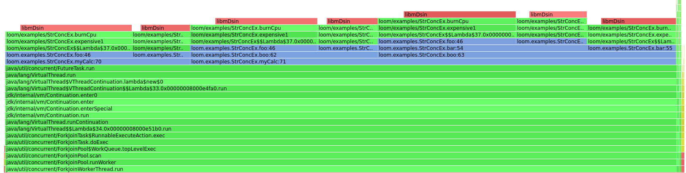

This example requires java 19 and a build of async-profiler including https://github.com/jvm-profiling-tools/async-profiler/pull/606

After building async-profiler, you'll need to add the async-profiler.jar to project libraries.

To use java 19 structured concurrency features, you'll need to change both compile and runtime options.  In IntelliJ,
go to 

> File | Settings | Build, Execution, Deployment | Compiler | Java Compiler

and add `--enable-preview --add-modules=jdk.incubator.concurrent` to `javac` line arguments.

Then, in the run target, you'll need to add to runtime `java` arguments:
```
--enable-preview --add-modules=jdk.incubator.concurrent -Djava.library.path=/path/to/async-profiler/build
```



